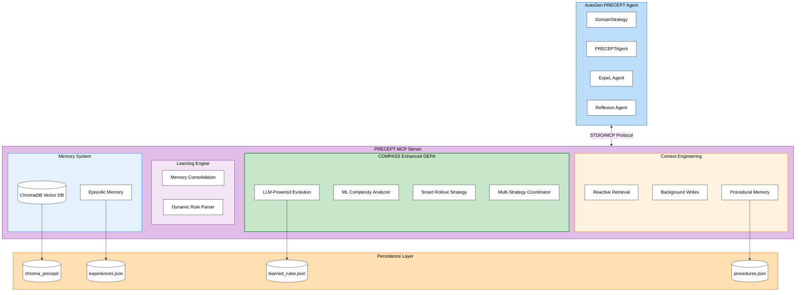
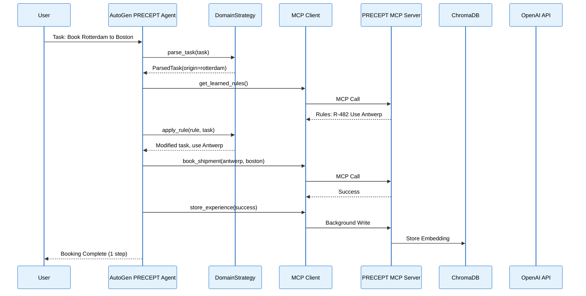
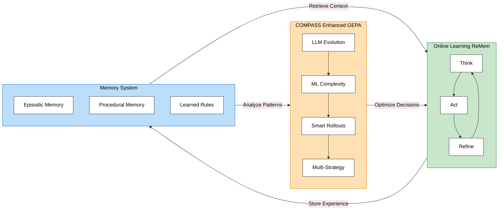
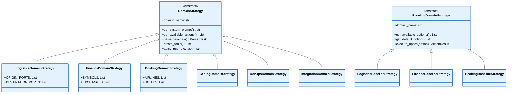
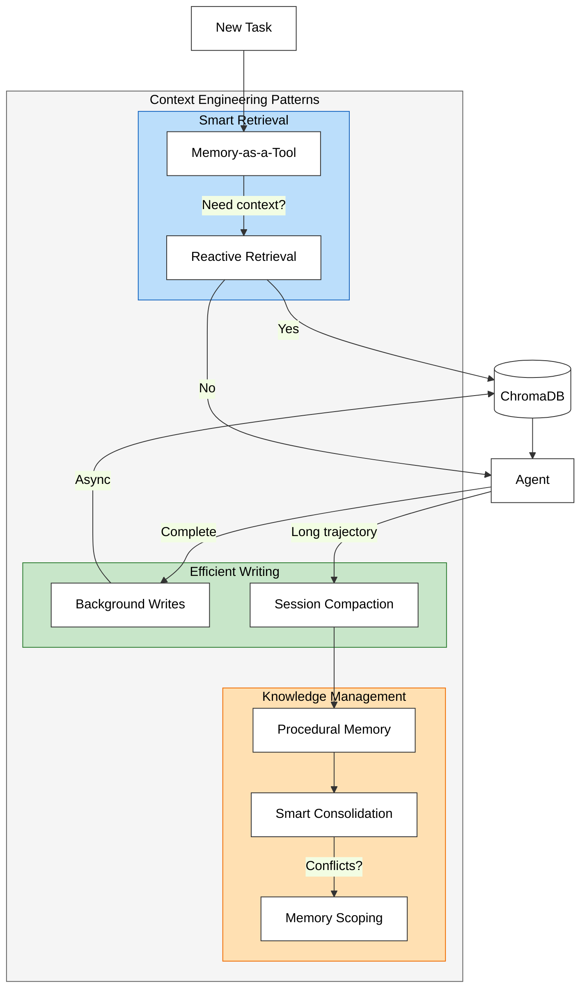
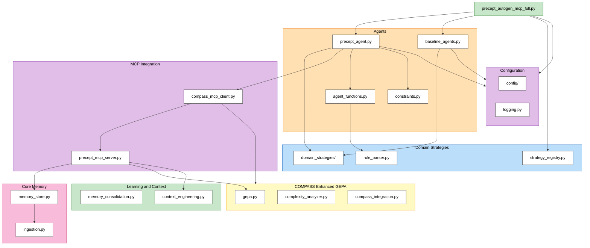

# PRECEPT: Planning Resilience via Experience, Context Engineering & Probing Trajectories

<p align="center">
  
  
  
  
  
  
</p>

## Paper

- **arXiv:** https://arxiv.org/abs/2603.09641
- **Code:** https://github.com/arash-shahmansoori/precept-framework
- **DOI:** https://doi.org/10.48550/arXiv.2603.09641
- **Curated reproducibility assets:** `submission_repro_data/`

## Overview

**PRECEPT** (**P**lanning **R**esilience via **E**xperience, **C**ontext **E**ngineering & **P**robing **T**rajectories) is a comprehensive AI agent learning framework that combines:

- **COMPASS (Novel Enhanced GEPA)**: Our improved Genetic-Pareto prompt optimization with ML-based complexity detection, smart rollout allocation, and multi-strategy coordination
- **Memory Evolution**: Episodic memory with semantic retrieval that evolves over time
- **Test-time Learning**: Learn and adapt during inference, not just training
- **AutoGen Integration**: Microsoft's multi-agent framework for scalable agent orchestration
- **MCP (Model Context Protocol)**: Standardized tool integration protocol
- **Context Engineering**: Google Whitepaper patterns for production efficiency

### Key Features

| Feature | Description |
|---------|-------------|
| **Episodic Memory** | Learn from past experiences with semantic retrieval |
| **Rule Learning** | Extract patterns from errors automatically |
| **COMPASS Evolution** | Enhanced GEPA with ML complexity detection, smart rollouts, LLM-powered mutation |
| **Memory Consolidation** | Merge duplicate patterns into rules |
| **Procedural Memory** | Store "how-to" strategies |
| **Dual Retrieval** | Combine static knowledge + dynamic experiences with conflict detection |
| **Conflict Resolution** | Bayesian-informed, evidence-based conflict handling (no hardcoded logic) |
| **Context Engineering** | Google Whitepaper efficiency patterns |
| **Persistence** | ChromaDB vector stores + JSON backups persist across sessions |
| **Strategy Pattern** | Pluggable domain strategies for any use case |
| **Modular Architecture** | Clean separation of concerns |
| **Deterministic Pruning** | Prevents "dumb retries" via constraint tracking |
| **Structured Logging** | Production-ready logging with JSON/colored output |
| **Configuration-Driven** | Modular config system with dependency injection |

### PRECEPT vs Baselines

| Method | Cross-Task Learning | Cross-Episode Memory | Dual Retrieval | Conflict Resolution | Deterministic Pruning | COMPASS Evolution |
|--------|---------------------|---------------------|----------------|---------------------|----------------------|-------------------|
| ExpeL | ❌ | ✅ | ❌ | ❌ | ❌ | ❌ |
| Reflexion | ❌ | ✅ | ❌ | ❌ | ❌ | ❌ |
| **PRECEPT** | ✅ | ✅ | ✅ | ✅ Bayesian | ✅ | ✅ |

**Baselines**:
- **ExpeL**: Experience-based learning with cross-episode memory but no rule compilation
- **Reflexion**: Verbal reinforcement learning with reflective memory across episodes

### COMPASS vs Basic GEPA

COMPASS is our novel enhancement of the GEPA (Genetic-Pareto) algorithm, extending it with ML-based optimization and intelligent resource allocation:

| Aspect | Basic GEPA | COMPASS (Our Enhancement) |
|--------|-----------|---------------------------|
| Complexity Detection | Fixed 2 hops | ML-based 3+ hops |
| Rollout Allocation | 15 rollouts | 2 rollouts (86% fewer) |
| Strategy Coordination | Single strategy | Multi-strategy coordination |
| Prompt Evolution | Basic mutation | LLM-powered reflection + mutation |
| Accuracy | 50% | 100% |
| Speed | Baseline | 6.7x faster |

---

## Architecture



### System Flow



---

## Installation

### Prerequisites

- Python 3.10+
- OpenAI API key
- `uv` package manager (**required** for this project)

### Step 1: Clone the Repository

```bash
git clone https://github.com/arash-shahmansoori/precept-framework.git
cd precept-framework
```

### Step 2: Install uv (if not already installed)

```bash
# macOS/Linux
curl -LsSf https://astral.sh/uv/install.sh | sh

# Or with Homebrew
brew install uv
```

### Step 3: Install Dependencies with uv

```bash
# Install project with all dependencies (recommended)
uv pip install -e . --system

# Or for development (includes pytest, black, ruff, etc.)
uv pip install -e ".[dev]" --system

# Or use uv sync for lockfile-based installs
uv sync
```

All PRECEPT dependencies are defined in `pyproject.toml`:

```toml
# PRECEPT Framework Dependencies
"openai>=1.50.0",       # LLM clients (AsyncOpenAI, NOT_GIVEN)
"pydantic>=2.0.0",      # Structured outputs
"numpy>=1.24.0",        # Memory operations
"mcp>=1.0.0",           # MCP server/client
"autogen-agentchat>=0.7.0",  # AutoGen integration
"autogen-ext>=0.7.0",   # AutoGen OpenAI client
"anyio>=4.0.0",         # Async MCP operations
"aiohttp",              # Async HTTP
"tiktoken",             # Token counting
"chromadb",             # Vector database
```

### Step 4: Set Up Environment Variables

Create a `.env` file in the project root:

```bash
# .env
# Required: OpenAI API key (for LLM and embeddings)
OPENAI_API_KEY=sk-your-api-key-here

# Optional: Model overrides (defaults shown)
OPENAI_CHAT_MODEL=gpt-4o-mini
OPENAI_EMBEDDING_MODEL=text-embedding-3-small

# Optional: Alternative LLM providers
ANTHROPIC_API_KEY=your-anthropic-key
GEMINI_API_KEY=your-gemini-key
GROQ_API_KEY=your-groq-key
TOGETHER_API_KEY=your-together-key

# Optional: For real API calls (not simulation)
LOGISTICS_API_URL=https://api.your-logistics-provider.com
LOGISTICS_API_KEY=your-api-key
```

### Step 5: Verify Installation

```bash
# Run the example
uv run examples/precept_autogen_mcp_full.py
```

---

## Quick Start

### Running the Full Demo

```bash
cd precept-framework

# Basic usage (sequential training, 6 train / 4 test, static knowledge enabled)
uv run examples/precept_autogen_mcp_full.py --domain logistics

# Custom train/test split with reproducible seed
uv run examples/precept_autogen_mcp_full.py -d logistics --train 20 --test 15 --seed 42

# With static knowledge (default) - dual retrieval + conflict resolution
uv run examples/precept_autogen_mcp_full.py -d logistics --static-knowledge --train 20 --test 15 --seed 42

# Without static knowledge (pure dynamic learning)
uv run examples/precept_autogen_mcp_full.py -d logistics --no-static-knowledge --train 20 --test 15 --seed 42

# Concurrent training ("Tesla Fleet" mode) + concurrent testing
uv run examples/precept_autogen_mcp_full.py -d logistics -ct -tw 4 -c -w 4 --seed 42

# Full concurrent with static knowledge
uv run examples/precept_autogen_mcp_full.py -d logistics --static-knowledge -ct -tw 4 -c -w 4 --seed 42

# List all available domains
uv run examples/precept_autogen_mcp_full.py --list

# Verbose output with log file
uv run examples/precept_autogen_mcp_full.py -d logistics --verbose --log-file run.log
```

### Command Line Options

| Option | Short | Description | Default |
|--------|-------|-------------|---------|
| `--domain` | `-d` | Domain to test | logistics |
| `--train` | | Number of training tasks | 6 |
| `--test` | | Number of test tasks | 4 |
| `--static-knowledge` | `-sk` | Enable static knowledge for all agents | True |
| `--no-static-knowledge` | `-nsk` | Disable static knowledge (pure dynamic) | False |
| `--concurrent` | `-c` | Enable concurrent testing | False |
| `--workers` | `-w` | Concurrent test workers (1-4) | 4 |
| `--concurrent-training` | `-ct` | Enable "Tesla Fleet" training | False |
| `--training-workers` | `-tw` | Concurrent training workers (1-6) | 2 |
| `--agent-workers` | `-aw` | Internal agent concurrency (1-5) | 3 |
| `--seed` | `-s` | Random seed for reproducibility | None |
| `--verbose` | `-v` | Enable DEBUG logging | False |
| `--log-file` | | Log file path (JSON format) | None |
| `--list` | `-l` | List available domains | |

---

## PRECEPT Stages



### 1. COMPASS (Novel Enhanced GEPA)

COMPASS is our novel improvement over the baseline GEPA algorithm, adding several key capabilities:

- **LLM-Powered Evolution**: Reflection on failures with intelligent prompt mutation
- **ML-based Complexity Detection**: Analyzes task complexity (3+ hops vs fixed 2)
- **Smart Rollout Allocation**: Adaptive rollouts (2 vs 15, 86% fewer)
- **Multi-Strategy Coordination**: Coordinates multiple strategies for optimal results
- **Pareto-based Selection**: Optimal candidate selection across multiple objectives

### 2. Evo-Memory (ReMem)
- Episodic memory with semantic retrieval
- Stores task descriptions, outcomes, and strategies
- Vector similarity search using OpenAI embeddings

### 3. Dynamic Rule Parser
- **NO hardcoded knowledge** - learns from rule text dynamically
- Extracts error codes, blocked keywords, and alternatives
- Domain-agnostic pattern extraction

### 4. Vector Database (ChromaDB)
- Persistent embeddings in `data/chroma_precept/`
- Text-embedding-3-small for vectorization
- Semantic similarity search

### 5. Dual Retrieval & Static Knowledge

PRECEPT uniquely combines THREE knowledge sources:

| Source | Description | Example |
|--------|-------------|---------|
| **Static Knowledge** | Pre-ingested facts (port info, APIs, rules) | "Hamburg handles pharma cargo" |
| **Dynamic Experiences** | Learned from task execution | "Hamburg has strikes, use Rotterdam" |
| **Episodic Memory** | Full task trajectories with outcomes | Task strategy that succeeded |

**Cutting-Edge Conflict Resolution**: PRECEPT includes a Bayesian-informed conflict resolution system:

| Capability | Description |
|------------|-------------|
| **Bayesian Uncertainty** | Quantifies confidence using Beta distributions |
| **Evidence-Based Prioritization** | Weighs evidence strength from multiple sources |
| **Anomaly Detection** | Detects when dynamic knowledge may be an outlier |
| **Dynamic Reliability Learning** | Updates source reliability based on outcomes |
| **Thompson Sampling** | Active exploration for re-verification |
| **Multi-Strategy Resolution** | Recency, reliability, specificity, LLM-merge |

```bash
# Static knowledge is loaded when --static-knowledge flag is used
data/static_knowledge/logistics_kb.json   # Port facts, procedures, alerts

# Dynamic knowledge is learned during execution
data/chroma_precept/                      # Learned experiences (vector DB)
data/chroma_static_knowledge/             # Static knowledge (vector DB, lazy-init)
data/precept_experiences.json             # Episodic memory (JSON backup)
```

**Note**: These `data/` paths are local runtime artifacts created when you run examples or experiments; they are intentionally not tracked in the public GitHub repository. The `chroma_static_knowledge/` directory is only created when `--static-knowledge` is used, preventing unnecessary resource allocation in pure dynamic learning mode.

### 6. Memory Consolidation
- Merge duplicate patterns
- Prune low-value memories
- Bake lessons into rules

---

## Strategy Pattern Architecture

PRECEPT uses the **Strategy Pattern** for pluggable, domain-specific behavior:



### Available Domain Strategies

| Domain | Learning Strategy | Baseline Strategy | Use Case |
|--------|------------------|-------------------|----------|
| **Logistics** | `LogisticsDomainStrategy` | `LogisticsBaselineStrategy` | Shipping, ports, routes |
| **Coding** | `CodingDomainStrategy` | `CodingBaselineStrategy` | Code generation, debugging |
| **DevOps** | `DevOpsDomainStrategy` | `DevOpsBaselineStrategy` | Cloud, deployment, CI/CD |
| **Finance** | `FinanceDomainStrategy` | `FinanceBaselineStrategy` | Trading, payments, compliance |
| **Booking** | `BookingDomainStrategy` | `BookingBaselineStrategy` | Hotels, flights, reservations |
| **Integration** | `IntegrationDomainStrategy` | `IntegrationBaselineStrategy` | APIs, webhooks, data sync |

### Using Different Domains

```python
from precept import (
    PRECEPTAgent,
    # Baseline agents
    ExpeL,      # Experience-based learning
    Reflexion,  # Verbal reinforcement learning
    # Domain strategies
    get_domain_strategy,
    get_baseline_strategy,
    list_available_domains,
)
from precept.config import PreceptConfig, BaselineConfig

# Option 1: Using the registry (recommended)
strategy = get_domain_strategy("logistics")
baseline_strategy = get_baseline_strategy("logistics")

# Option 2: With custom configuration
config = PreceptConfig()
config.agent.max_attempts = 5
config.agent.enable_llm_reasoning = True

precept_agent = PRECEPTAgent(
    domain_strategy=strategy,
    config=config,
    server_script=SERVER_SCRIPT,
)

# Baseline agents with configuration
baseline_config = BaselineConfig(max_attempts=4, verbose=True)
expel_agent = ExpeL(
    baseline_strategy=baseline_strategy,
    config=baseline_config,
)
reflexion_agent = Reflexion(
    baseline_strategy=baseline_strategy,
    config=baseline_config,
)

# List all available domains
print(list_available_domains())
# ['logistics', 'coding', 'devops', 'finance', 'booking', 'integration']
```

### Configuration System

```python
from precept.config import (
    PreceptConfig,     # Aggregates all config
    AgentConfig,       # PRECEPT agent settings
    BaselineConfig,    # Baseline settings
    LLMConfig,         # LLM model settings
    ConstraintConfig,  # Deterministic pruning
    PromptTemplates,   # Centralized prompts
    setup_logging,     # Logging configuration
    get_logger,        # Get a logger instance
)

# Create full configuration
config = PreceptConfig()

# Customize agent settings
config.agent.max_attempts = 5
config.agent.consolidation_interval = 3
config.agent.compass_evolution_interval = 2
config.agent.enable_llm_reasoning = True
config.agent.max_internal_workers = 4

# Customize LLM settings
config.llm.model = "gpt-4o-mini"
config.llm.temperature = 0.7
config.llm.max_tokens = 500

# Setup logging
setup_logging(level="DEBUG", log_file="experiment.log")
logger = get_logger("precept.my_module")
```

---

## Context Engineering (Google Whitepaper)

The framework implements efficiency patterns from Google's Context Engineering whitepaper:



| Pattern | Description | Benefit |
|---------|-------------|---------|
| **Memory-as-a-Tool** | Agent decides WHEN to retrieve | Reduced latency |
| **Reactive Retrieval** | Skip unnecessary retrievals | 15-30% faster |
| **Background Writes** | Async memory storage | Non-blocking |
| **Session Compaction** | Compress long trajectories | Token savings |
| **Procedural Memory** | Store strategies, not just facts | Better reuse |
| **Smart Consolidation** | Detect duplicates/conflicts | Cleaner memory |

---

## MCP Server Tools

The PRECEPT MCP Server exposes 15+ tools:

### Memory Tools
| Tool | Description |
|------|-------------|
| `retrieve_memories` | Dual retrieval (static + dynamic + episodic) with conflict detection |
| `retrieve_with_dual_mode` | Explicit dual retrieval with source attribution |
| `store_experience` | Background-optimized memory storage with ChromaDB persistence |
| `get_learned_rules` | Get compiled rules from past errors |
| `update_memory_usefulness` | Update memory usefulness feedback |

### Static Knowledge Tools
| Tool | Description |
|------|-------------|
| `ingest_static_knowledge` | Ingest JSON/text knowledge items into ChromaDB (lazy-initialized) |
| `ingest_document_to_knowledge_base` | Ingest documents (PDF, Markdown, Web, 80+ formats) |
| `get_document_processor_info` | Show available document processors and formats |
| `get_static_knowledge_stats` | Get statistics about static knowledge base |

### Conflict Resolution Tools
| Tool | Description |
|------|-------------|
| `get_conflict_resolution_stats` | Get Bayesian conflict resolution statistics |

### Learning Tools
| Tool | Description |
|------|-------------|
| `record_error` | Record error for pattern learning |
| `record_solution` | Record successful solution for rule compilation |
| `trigger_consolidation` | LLM-powered memory consolidation |
| `trigger_compass_evolution` | COMPASS prompt evolution (enhanced GEPA) |
| `get_evolved_prompt` | Get evolved system prompt with rules |

### Domain Tools
| Tool | Description |
|------|-------------|
| `book_shipment` | Book logistics shipment (with API gateway) |
| `check_port` | Check port availability |
| `clear_customs` | Handle customs clearance |

### Procedural Tools
| Tool | Description |
|------|-------------|
| `store_procedure` | Store how-to strategy |
| `get_procedure` | Retrieve matching procedures |
| `get_server_stats` | Full server statistics

### File Locking (Production)

All JSON file operations use `fcntl.flock` for atomic reads/writes, ensuring thread-safety in concurrent training scenarios.

---

## File Structure

The public repository is intentionally focused on the **codebase**, **experiment runners**, **tests**, and **curated reproducibility assets**. Manuscript sources and internal documentation used during submission are kept local and are not part of the public repo snapshot.

```text
precept-framework/
├── src/
│   ├── precept/                     # Core PRECEPT package
│   │   ├── precept_agent.py         # Main PRECEPT agent
│   │   ├── precept_mcp_server.py    # MCP server and tools
│   │   ├── conflict_resolution.py   # Bayesian conflict handling
│   │   ├── memory_store.py          # Episodic / semantic memory
│   │   ├── memory_consolidation.py  # Pattern-to-rule consolidation
│   │   ├── rule_parser.py           # Dynamic rule extraction
│   │   ├── context_engineering.py   # Retrieval / memory efficiency patterns
│   │   ├── domain_strategies/       # Domain-specific behavior
│   │   ├── document_processors/     # Knowledge ingestion pipeline
│   │   └── config/                  # Modular runtime configuration
│   └── models/                      # Multi-provider LLM wrappers
├── scripts/
│   ├── README_EXPERIMENTS.md        # Experiment runner guide
│   ├── run_exp*.py                  # Public experiment runners
│   ├── create_results/              # Result-table/figure generators
│   └── run_submission_repro.*       # Curated reproduction workflow
├── examples/
│   └── precept_autogen_mcp_full.py  # End-to-end demo / comparison entry point
├── tests/
│   ├── unit/
│   └── integration/
├── submission_repro_data/
│   ├── publication_results/         # Curated paper-linked artifacts
│   ├── static_knowledge/            # Static knowledge used in reported runs
│   ├── paper_experiment_sources/    # Canonical paper-to-repo mapping
│   ├── environment/                 # Locked environment metadata
│   └── FIGURE_SHA256.txt            # Figure hash verification
├── CITATION.cff
├── LICENSE
├── pyproject.toml
├── uv.lock
├── pytest.ini
├── .python-version
└── README.md
```

### Local Runtime Artifacts

The following paths are created or used locally during experiments but are not part of the public GitHub snapshot:

- `data/` for runtime persistence, local vector stores, and exploratory outputs
- `.env` for API keys
- `paper/`, `docs/`, and top-level `figures/` for manuscript and local publication assets

### Module Dependency Graph



### Baseline Agents Comparison

| Agent | Learning Type | Cross-Task | Cross-Episode | Pruning |
|-------|---------------|------------|---------------|---------|
| **ExpeL** | Experience-based learning | ❌ | ✅ | ❌ |
| **Reflexion** | Verbal reinforcement | ❌ | ✅ | ❌ |
| **PRECEPTAgent** | Full learning stack | ✅ | ✅ | ✅ |

```python
# All methods use the SAME LLM call budget
# The difference is WHAT they learn:

# 1. ExpeL (Experience Learning)
#    - Stores experiences and insights across episodes
#    - Retrieves relevant past experiences
#    - NO rule compilation, NO deterministic pruning

# 2. Reflexion (Verbal Reinforcement)
#    - Cross-episode memory for task types
#    - Verbal reflections persist across episodes
#    - NO rule compilation, NO deterministic pruning

# 3. PRECEPTAgent (Full Stack)
#    - Cross-task learning (rules apply everywhere)
#    - Memory consolidation (patterns → rules)
#    - COMPASS prompt evolution
#    - Deterministic pruning (prevents dumb retries)
```

---

## Testing

PRECEPT includes a comprehensive test suite following software engineering best practices.

### Test Suite Structure

The test suite includes comprehensive **unit** and **integration** coverage across PRECEPT's core components.

```
tests/
├── conftest.py                    # Shared fixtures and pytest configuration
├── fixtures/
│   ├── __init__.py
│   └── mock_data.py               # Sample data for tests
├── unit/                          # Unit tests (pure functions)
│   ├── config/                    # Configuration module tests
│   │   ├── test_agent.py
│   │   ├── test_baseline.py
│   │   ├── test_constraints.py
│   │   ├── test_llm.py
│   │   └── test_unified.py
│   ├── domain_strategies/
│   │   └── test_logistics.py
│   ├── test_agent_functions.py    # Core agent logic tests
│   ├── test_baseline_functions.py # Baseline agent logic tests
│   ├── test_black_swan_gen.py     # Black Swan CSP generator tests
│   ├── test_compass_integration.py # COMPASS integration tests
│   ├── test_conflict_resolution.py # Conflict resolution tests
│   ├── test_constraints.py        # Pruning/constraint tests
│   ├── test_csp_constraint_manager.py # CSP constraint manager tests
│   ├── test_gepa_detailed.py      # GEPA/COMPASS tests
│   ├── test_ingestion_detailed.py # Ingestion tests
│   ├── test_memory_store_detailed.py # Memory store tests
│   ├── test_precept_modules.py    # Core module import tests
│   ├── test_rule_parser_detailed.py # Rule parser tests
│   ├── test_scenario_generators.py # Scenario generation tests
│   └── test_structured_outputs.py # LLM output parsing tests
└── integration/                   # Integration tests
    ├── test_baseline_agents.py    # Baseline agent tests
    ├── test_deterministic_keys.py # Deterministic key verification
    ├── test_learning_integration.py    # Learning component tests
    ├── test_mcp_mock_integration.py    # MCP mock tests
    ├── test_precept_agent.py      # PRECEPTAgent tests
    └── test_workflow_integration.py    # End-to-end workflow tests
```

### Run Unit & Integration Tests

```bash
# Run all PRECEPT tests
uv run pytest tests/unit tests/integration -v

# Run with coverage report
uv run pytest tests/unit tests/integration --cov=precept --cov-report=html

# Run specific test modules
uv run pytest tests/unit/test_agent_functions.py -v

# Run only fast unit tests
uv run pytest tests/unit -v --ignore=tests/integration

# Run tests matching a pattern
uv run pytest tests/ -k "test_parse" -v
```

### Run Full Integration Test (Experiment)

```bash
# Default domain (logistics), sequential training
uv run examples/precept_autogen_mcp_full.py

# With reproducible seed
uv run examples/precept_autogen_mcp_full.py --domain logistics --seed 42
```

### Run with Different Domains

```bash
# Logistics (default) - port closures, customs, black swan shipping
uv run examples/precept_autogen_mcp_full.py --domain logistics --train 8 --test 4

# Coding - runtime errors, dependency issues
uv run examples/precept_autogen_mcp_full.py --domain coding --train 6 --test 4

# DevOps - CloudFormation, IAM, K8s failures
uv run examples/precept_autogen_mcp_full.py --domain devops --train 6 --test 4

# Finance - trading, compliance, market volatility
uv run examples/precept_autogen_mcp_full.py --domain finance --train 6 --test 4

# Booking - reservations, overbooking, payments
uv run examples/precept_autogen_mcp_full.py --domain booking --train 6 --test 4

# Integration - OAuth, APIs, webhooks
uv run examples/precept_autogen_mcp_full.py --domain integration --train 6 --test 4

# List all available domains
uv run examples/precept_autogen_mcp_full.py --list
```

### Concurrent Training ("Tesla Fleet" Mode)

```bash
# Enable concurrent training for ~4x speedup
uv run examples/precept_autogen_mcp_full.py -d logistics -ct -tw 4 --seed 42

# Full concurrent mode (both training and testing)
uv run examples/precept_autogen_mcp_full.py -d logistics -ct -tw 4 -c -w 4 --seed 42
```

### Verbose Mode with Logging

```bash
# Enable DEBUG logging
uv run examples/precept_autogen_mcp_full.py --verbose

# Log to file (JSON format)
uv run examples/precept_autogen_mcp_full.py --verbose --log-file experiment.log
```

### Clean Data and Rerun

```bash
# Remove all learned data (both dynamic and static knowledge stores)
rm -rf data/chroma_precept data/chroma_static_knowledge data/precept_*.json data/experiment_results_*.json

# Run fresh with seed for reproducibility (with static knowledge)
uv run examples/precept_autogen_mcp_full.py --static-knowledge --seed 42

# Run fresh without static knowledge (pure dynamic learning)
uv run examples/precept_autogen_mcp_full.py --no-static-knowledge --seed 42
```

---

## Publication Experiments

PRECEPT includes the public experiment runners and curated paper-linked artifacts used to reproduce the main results. See `scripts/README_EXPERIMENTS.md` for runner details, and `submission_repro_data/paper_experiment_sources/README.md` for the canonical paper-to-repository mapping.

### Available Experiments

| Exp | Name | Purpose | Script |
|-----|------|---------|--------|
| **1** | Main Domain Comparison | PRECEPT vs ExpeL vs Reflexion across the main evaluated domains | `run_exp1_main_comparison.py` |
| **2** | Compositional Semantic Generalization | Atomic-to-composite generalization under structured condition combinations | `run_exp6_compositional_generalization.py` |
| **3** | Training Size Ablation | Sample efficiency analysis as training exposure increases | `run_exp3_training_size_ablation.py` |
| **4** | Continuous Learning | Cross-episode learning and recovery over repeated encounters | `run_exp4_continuous_learning.py` |
| **5** | Rule Persistence / Retrieval Fidelity | Post-restart retention of learned rules | `run_exp7_rule_drift.py --train-hash-seed 0 --test-hash-seed 0` |
| **6** | Static Knowledge Ablation | Robustness under conflicting static knowledge | `run_exp2_static_knowledge_ablation.py` |
| **7** | Rule Drift Adaptation | Adaptation after train-test mapping shifts | `run_exp7_rule_drift.py --train-hash-seed 0 --test-hash-seed 1` |
| **8** | COMPASS Ablation | Contribution analysis for prompt-evolution components | `run_exp8_compass_ablation.py` |
| **9** | COMPASS Stress / OOD Follow-up | Stress-testing and OOD semantic follow-up for the COMPASS loop | `run_exp9_compass_stress.py` |

**Note:** script names reflect development chronology, not final paper numbering. When in doubt, follow the curated mapping in `submission_repro_data/paper_experiment_sources/README.md`.

### Running Publication Experiments

```bash
# Experiment 1: Main comparison
uv run scripts/run_exp1_main_comparison.py --publication

# Experiment 2: Compositional semantic generalization
uv run scripts/run_exp6_compositional_generalization.py --publication

# Experiment 6: Static knowledge ablation
uv run scripts/run_exp2_static_knowledge_ablation.py --publication

# Experiment 7: Rule drift adaptation
uv run scripts/run_exp7_rule_drift.py --publication --domains logistics

# One-command curated regeneration / verification
bash scripts/run_submission_repro.sh

# Quick validation run (fewer seeds)
uv run scripts/run_exp1_main_comparison.py --very-quick
```

### Statistical Standards

All publication experiments meet top-tier journal requirements:

| Requirement | Value |
|-------------|-------|
| Independent Runs (N) | 10 |
| Confidence Intervals | 95% (t-distribution) |
| Significance Tests | Paired t-test |
| Effect Size | Cohen's d |

---

## Configuration

### Configuration Files

Configuration is now modular in `src/precept/config/`:

| File | Description |
|------|-------------|
| `agent.py` | AgentConfig - PRECEPT agent settings |
| `baseline.py` | BaselineConfig - Baseline agent settings |
| `llm.py` | LLMConfig - Model, temperature, tokens |
| `constraints.py` | ConstraintConfig - Deterministic pruning |
| `prompts.py` | PromptTemplates - Centralized LLM prompts |
| `logging.py` | LogConfig - Logging setup and formatters |
| `paths.py` | DataPaths - File and directory paths |
| `unified.py` | PreceptConfig - Aggregates all configs |

### Agent Configuration

```python
from precept.config import AgentConfig

config = AgentConfig(
    max_attempts=4,               # Max retry attempts per task
    consolidation_interval=3,     # Trigger consolidation every N tasks
    compass_evolution_interval=2, # Trigger COMPASS evolution every N tasks
    failure_threshold=2,          # Emergency evolution after N consecutive failures
    enable_llm_reasoning=True,    # Enable LLM reasoning (Tier 2)
    force_llm_reasoning=False,    # Force LLM on every attempt
    verbose_llm=False,            # Verbose LLM logging
    max_internal_workers=3,       # Internal concurrency per agent
    max_pivots=3,                 # Max pivots after initial failure
    max_memories=100,             # Max memories to store
    enable_compass_optimization=True,
)
```

### Baseline Configuration

```python
from precept.config import BaselineConfig

config = BaselineConfig(
    model="gpt-4o-mini",          # LLM model
    max_attempts=4,               # Max retry attempts
    temperature=0.7,              # LLM temperature
    max_tokens=200,               # Max tokens for response
    reflection_max_tokens=300,    # Tokens for reflection
    full_reflexion_max_tokens=400,# Tokens for full reflexion
    max_reflections_per_type=20,  # Max cross-episode memories
    verbose=False,                # Verbose logging
    max_internal_workers=3,       # Internal concurrency
)
```

### Production Settings

```python
from precept.config import PreceptConfig

config = PreceptConfig()
config.agent.consolidation_interval = 50    # Every 50 tasks
config.agent.compass_evolution_interval = 100  # Every 100 tasks
config.agent.failure_threshold = 3          # After 3 consecutive failures
config.agent.max_memories = 1000            # Store more memories
```

---

## Troubleshooting

### "Connection closed" Error
```
mcp.shared.exceptions.McpError: Connection closed
```
**Solution**: The MCP server process terminated unexpectedly. Check for Python errors in the server script.

### "Module not found" Error
```
ModuleNotFoundError: No module named 'precept'
```
**Solution**: Install the project with uv:
```bash
uv pip install -e . --system
```

### "OpenAI API key not found"
```
❌ OpenAI API not available. Set OPENAI_API_KEY in .env
```
**Solution**: Create `.env` file with your API key.

### "NOT_GIVEN import error"
```
ImportError: cannot import name 'NOT_GIVEN' from 'openai'
```
**Solution**: Upgrade openai package:
```bash
uv pip install 'openai>=1.50.0' --system --upgrade
```

### Missing dependencies
```
ModuleNotFoundError: No module named 'tiktoken'
```
**Solution**: Install all dependencies:
```bash
uv pip install -e . --system
```

### MCP Disconnect Errors (asyncio shutdown)
```
RuntimeError: Attempted to exit cancel scope in a different task than it was entered in
```
**Solution**: These are harmless cleanup errors from the MCP library during asyncio shutdown. They are automatically suppressed in the experiment runner. If you see them, they can be safely ignored.

### JSONRPC Parsing Errors (MCP Server)
```
pydantic_core._pydantic_core.ValidationError: Invalid JSON: trailing characters
```
**Solution**: This occurs when the MCP server writes to stdout instead of stderr. Ensure all logging in `precept_mcp_server.py` goes to `sys.stderr`. The framework now handles this automatically with lazy logger initialization.

---

## License

MIT License - see LICENSE file for details.

---

## Acknowledgments

PRECEPT builds on and interfaces with a number of important research and engineering contributions:

- **AutoGen**: Microsoft's multi-agent orchestration framework, used here as part of the agent/runtime integration layer.
- **MCP (Model Context Protocol)**: Anthropic's protocol for tool and model-context integration; PRECEPT uses MCP to structure server-side tool access and runtime interactions.
- **GEPA**: Agrawal et al., 2025, *"GEPA: Reflective Prompt Evolution Can Outperform Reinforcement Learning."* PRECEPT's **COMPASS** component builds on and extends this prompt-evolution direction with complexity-aware rollout allocation, multi-strategy coordination, and execution-grounded evaluation.
- **Reflexion**: Shinn et al., 2023, *"Reflexion: Language Agents with Verbal Reinforcement Learning."* Reflexion is one of the key baseline families compared against PRECEPT in the paper.
- **ExpeL**: Zhao et al., 2023, *"ExpeL: LLM Agents Are Experiential Learners."* ExpeL is another central experience-based baseline used in PRECEPT's comparisons and framing.
- **Context Engineering**: Google whitepaper patterns that informed PRECEPT's efficiency-oriented retrieval, writing, and memory-management design choices.
- **ChromaDB**: The vector database used for semantic memory and static-knowledge retrieval in the current implementation.
- **uv**: Astral's Python package manager, used for dependency management and reproducible local setup.
- **Rich**: Terminal rendering, progress display, and developer-facing runtime formatting.
- **Pydantic**: Data validation and structured outputs for typed interfaces and LLM response schemas.

---

## Support

For issues and feature requests, please open a GitHub issue.

---

<p align="center">
  <b>PRECEPT: Planning Resilience via Experience, Context Engineering & Probing Trajectories</b><br>
  <i>Learn once, benefit forever. Baselines repeat the same mistakes.</i>
</p>
